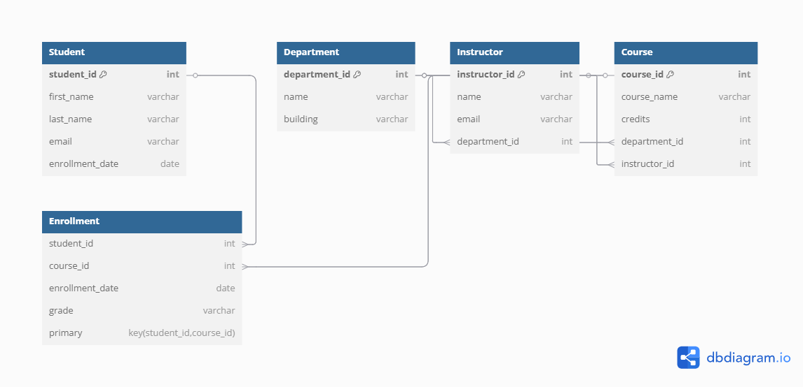

# 🎓 Student Records Management System (MySQL Project)

## 📘 Project Description

This project implements a **relational database** for managing student academic records. It tracks students, instructors, departments, courses, and enrollment information using structured SQL and follows best practices in database normalization.

---

## 📂 Features

- Stores student, instructor, course, and department data
- Tracks student enrollment and grades
- Enforces data integrity through:
  - Primary and foreign keys
  - Unique and not-null constraints
  - 1-to-many and many-to-many relationships

---

## 🗃️ Database Tables

| Table Name   | Description                                      |
|--------------|--------------------------------------------------|
| `Student`     | Stores student personal info and enrollment date |
| `Department`  | Academic departments (e.g., Math, History)       |
| `Instructor`  | Instructors and their associated departments     |
| `Course`      | Courses offered, credits, and assigned instructor|
| `Enrollment`  | Many-to-many relationship between students and courses, with grades |

---

## 🧠 Technologies Used

- MySQL
- SQL DDL (Data Definition Language)
- ER Modeling

Here is the Entity-Relationship Diagram for the Student Records database:



---

## ⚙️ How to Run

1. Open **MySQL Workbench** or your preferred MySQL interface.
2. Run the provided `student_records.sql` file:
   ```sql
   SOURCE C:\Users\John Ogabu\Documents\Database\student_records.sql;
